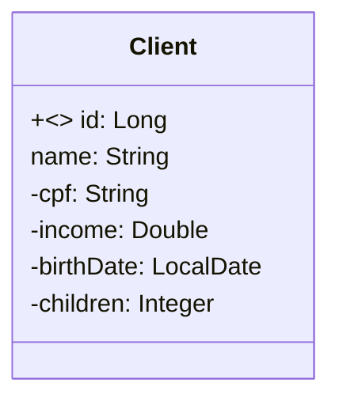

Este documento descreve o desafio de criar um CRUD (Create, Read, Update, Delete) completo de web services REST para um recurso de clientes, utilizando Spring Boot.

## Formação Desenvolvedor Moderno

  * **Módulo:** Back end
  * **Capítulo:** API REST, camadas, CRUD, exceções, validações
  * **DESAFIO:** CRUD de clientes
  * **Forma de entrega:** link do projeto no Github
  * **DEVSUPERIOR:** [https://devsuperior.com.br](https://devsuperior.com.br)

## Requisitos do Projeto

O projeto deve ser um Spring Boot com um CRUD completo de web services REST para clientes.

### Operações básicas a serem implementadas:

  * Busca paginada de recursos
  * Busca de recurso por ID
  * Inserir novo recurso
  * Atualizar recurso
  * Deletar recurso

### Configuração do Ambiente

  * Ambiente de testes configurado.
  * Acesso ao banco de dados H2.
  * Maven como gerenciador de dependência.
  * Java como linguagem.

### Entidade `Client`

Um cliente possui nome, CPF, renda, data de nascimento e quantidade de filhos. A especificação da entidade `Client` é a seguinte:



*Observação:* A JPA transforma nomes de atributos de `camelCase` para `snake_case`. Assim, `birthDate` será `birth_date` no banco de dados.

### Seed de Dados

O projeto deve conter um "seed" de pelo menos 10 clientes com dados significativos (não usar dados genéricos como "Nome 1", "Nome 2", etc.).

### Tratamento de Exceções

O projeto deve tratar as seguintes exceções:

  * **ID não encontrado:** Retornar código 404 para GET por ID, PUT e DELETE.
  * **Erro de validação:** Retornar código 422 e mensagens customizadas para cada campo inválido.
      * **Regras de validação:**
          * Nome: não pode ser vazio.
          * Data de nascimento: não pode ser data futura (usar `@PastOrPresent`).

## Observações Importantes

  * Criar um **novo projeto** para este trabalho. Não acrescentar a classe `Client` em projetos anteriores.
  * Cuidado para não salvar arquivos e pastas desnecessárias no Git (ex: `.metadata` do Eclipse ou `.idea` do IntelliJ).

## Como o Trabalho Será Corrigido

### 1\. Importação do Projeto

O professor deve ser capaz de clonar o projeto do Github, importar e executar na IDE sem configurações especiais.

### 2\. Testes Manuais no Postman

O professor testará as seguintes requisições no Postman:

  * **Busca de cliente por ID:**

      * `GET /clients/1`

  * **Busca paginada de clientes:**

      * `GET /clients?page=0&size=6&sort=name`

  * **Inserção de novo cliente:**

      * `POST /clients`
      * Exemplo de corpo da requisição:
        ```json
        {
          "name": "Maria Silva",
          "cpf": "12345678901",
          "income": 6500.0,
          "birthDate": "1994-07-20",
          "children": 2
        }
        ```

  * **Atualização de cliente:**

      * `PUT /clients/1`
      * Exemplo de corpo da requisição:
        ```json
        {
          "name": "Maria Silvaaa",
          "cpf": "12345678901",
          "income": 6500.0,
          "birthDate": "1994-07-20",
          "children": 2
        }
        ```

  * **Deleção de cliente:**

      * `DELETE /clients/1`

### CHECKLIST para Correção:

1.  Busca por ID retorna cliente existente.
2.  Busca por ID retorna 404 para cliente inexistente.
3.  Busca paginada retorna listagem paginada corretamente.
4.  Inserção de cliente insere cliente com dados válidos.
5.  Inserção de cliente retorna 422 e mensagens customizadas com dados inválidos.
6.  Atualização de cliente atualiza cliente com dados válidos.
7.  Atualização de cliente retorna 404 para cliente inexistente.
8.  Atualização de cliente retorna 422 e mensagens customizadas com dados inválidos.
9.  Deleção de cliente deleta cliente existente.
10. Deleção de cliente retorna 404 para cliente inexistente.